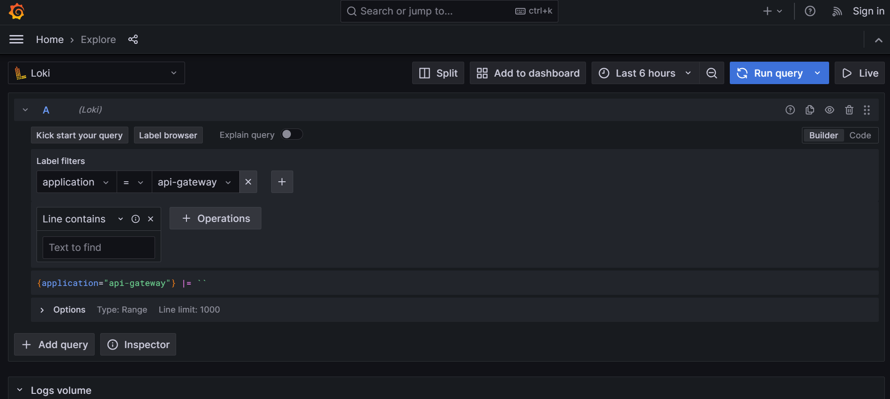

# api-gateway-with-observability  

- This is a spring boot project for api gateway with keycloak, mysql and docker compose.
- Observabiltiy has been implemented with Grafana stack such as Loki, Tempo, Prometheus.
- The circuit breaker pattern has been implemented with resilience4j.  
- API documentations of other microservices with swagger has been aggregated with in api gateway. 

## Screenshots

Dashboard

Loki

 

Tempo

 

Prometheus

 
